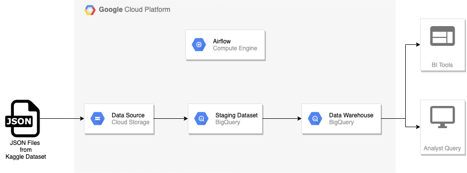
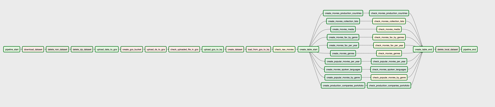
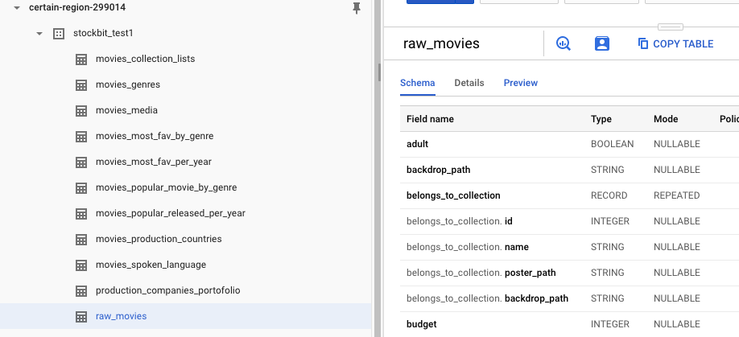

# DWH Project Description: TMDB Movie

### Project Summary

This projects creates a data warehouse and data pipeline on Google Cloud Platform (GCP) using movie dataset from TMDB at this [Kaggle dataset](https://www.kaggle.com/edgartanaka1/tmdb-movies-and-series). This data warehouse will help movie analyst to analyze anything about movies (moviegoers, movie industry, production companies, etc).

### Data Sources

- TMDB movies and series: This data came from this [Kaggle dataset](https://www.kaggle.com/edgartanaka1/tmdb-movies-and-series) in JSON format.

### Architecture

Multiple JSON files is downloaded and after that dataset `movies` will be uploaded to a bucket in Google Cloud Storage and all files will be loaded to staging table on BigQuery. ETL process will take data from staging table and create datamart tables. An Airflow instance will be deployed on Google Compute Engine to orchestrate the data pipeline.

### Data Model

This data warehouse will have 11 tables with 1 tables as staging table:

- `raw_movies`: contains raw data from all JSON files in GCS bucket. It will be used as staging table for creating datamart tables.
- `movies_media`: contains media for movies such as poster, backdrop, video, etc.
- `movies_genres`: contains genre_id and genre name.
- `movies_collection_lists`:  contains movie collections and its movie lists.
- `movies_most_fav_by_genre`: contains most favourite movies group by genre. Most favourite movies will be decided by user votes.
- `movies_most_fav_per_year`: contains most favourite movies each year. Most favourite movies will be decided by user votes.
- `movies_popular_movie_by_genre`: contains popular movie by genre. Popular movie will be decided by popularity score.
- `movies_popular_released_per_year`: contains popular movie each year. Popular movie will be decided by popularity score.
- `movies_production_countries`: contains country code and country name.
- `movies_spoken_language`: contains language code and language name.
- `production_companies portofolio`: contains production house portofolio (genres, revenue, budget, etc)

### Data Pipeline

This project uses Airflow for workflow orchestration.

A Dummy Operator `pipeline_start` start up the pipeline by downloading dataset from Kaggle. After that, `upload_data_to_gcs` task will  upload selected JSON files (in this pipeline 10000 files) to GCS bucket by creating GCS bucket first and then upload it. After uploading the JSON files, there is a operation to check uploaded files in GCS bucket.

From Dummy Operator `upload_gcs_to_bq` kick off the process to load all JSON files in GCS bucket to staging table `raw_movies` by creating dataset first,  start to load table from bucket with`load_from_gcs_to_bq` task and check the staging table rows by `check_raw_movies` task.

After successfully load the JSON Files into BigQuery dataset staging table, from that the task continue to create each datamart table in parallel and the pipeline finished.

### Data Warehouse

The final data warehouse looks like this:

---